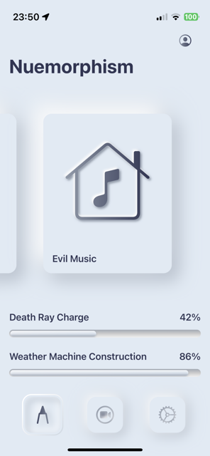
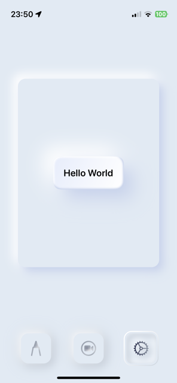

# Nuemorphism

Neumorphism often referred to as Soft design, is a skeuomorphic design adaption coupled with flat design.

It is a visual effect that mixes background colours, shadows, shapes, gradients, and highlights to achieve intense yet minimal real-life graphic effects on the user interface elements.

Neumorphic design draws from both skeumorphism and flat design by pairing a monochromatic color palette with subtle shadows that make the calculator's buttons appear tactile.

The lowered contrast between foreground and background gives the calculator a soft finish, and the overall effect is a simplified realism.

## Preview

